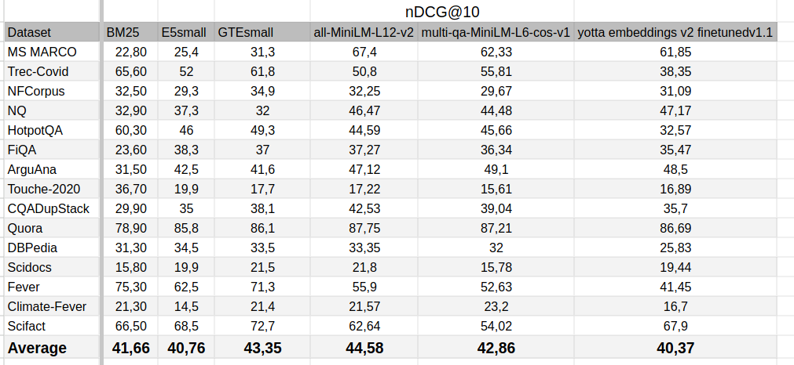

## Yotta Embedings

B.S. thesis project, Text embedding model for semantic search.

Model is based on [MiniLM-L12-H384-uncased](https://huggingface.co/microsoft/MiniLM-L12-H384-uncased) and can be found on [huggingface](https://huggingface.co/djovak/yotta-embeddings).

Idea of the project was to replicate results of opensource SOTA models of the same size with limited resources. Training was done on 4xV100 GPU server(sponsored by [yottaanswers.com](http://yottaanswers.com)).

To enable big enough batch size for contrastive learning, few techniques were used:
- casting model to fp16
- reducing training input sizes to (query: 64 tokens, document: 128 tokens)
- deepspeed ZeRO 2 optimization
- gradient checkpointing

Project implements ideas from [general text embeddings paper](https://arxiv.org/pdf/2308.03281.pdf) and [Flag Embeddings](https://github.com/FlagOpen/FlagEmbedding)

## datasets

All used datasets can be found on [this page](https://huggingface.co/datasets/sentence-transformers/embedding-training-data).

## results

Last column reprezents result of our model. nDCG@10 metric was used.
Results of `BM25`, `E5-small` and `GTE-small` were taken from [GTE paper](https://arxiv.org/pdf/2308.03281.pdf).

TODO upload whole BEIR benchmark table

### env

TODO

### run training

training can be run by `run_torch_distributed.sh`

sencond stage, finetuning can be run by `run_torch_distributed_finetune.sh`

TODO

## usage

TODO

can be used as any other sentence bert model([sbert tutorial](https://www.sbert.net/docs/quickstart.html)) by using `djovak/yotta-embeddings` as model name

